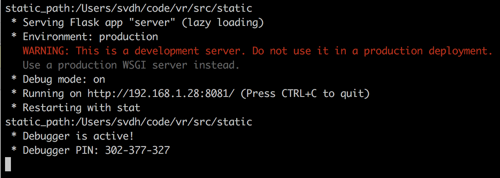

# VR Demos

## Prerequisits

### Homebrew

```python
/usr/bin/ruby -e "$(curl -fsSL https://raw.githubusercontent.com/Homebrew/install/master/install)"
```

### pyenv

install Pyenv if it is not present on you system

```
> brew update
> brew install pyenv
```

append this line to your shell

```
> pyenv init
```

Set python globally to

```
> pyenv install 3.6.5
> pyenv global 3.6.5
```

### pipenv

```
> brew install pipenv
```

## how to run this software

``` 
> pipenv run python src/server.py
 ```
 
 The output should be:



Open the URL in your browser


Click on the small googles icon in the lower right to launch the demo in full screen or VR of your device supports it.


## How to access the server on your laptop from your phone or VR headset.

#### Wifi access router allows multicast

If the wifi network allows access directly between to devices connected to it. Use the IP adress shown when the server launches on the phone and it will work

### Direct laptop access

In this case we will connect the phone directly to the wifi on the laptop.

#### MacOs

You need to have a loopback device in addition to the defaul build in one.
If not yet done create one by entering the following commands in a terminal.

```
sudo networksetup -createnetworkservice Loopback lo0
sudo networksetup -setmanual Loopback 172.20.42.42 255.255.255.255
``` 

Now go to the sytem preferences:
- click on sharing
- click on internet sharing
- select lo0 for the 'share your connection from'
- select wifi for the 'To computer using'
- then check the check box of internet sharing.

No in the terminal relaunch the server with the command

```python
pipenv run python src/server.py serve --nic lo0
```

Now the server will listen to the loop back device

Connect your phone or VR headset the laptop wifi

And enter the address the serve has outputed.

#### Windos

TBD

#### Linux

TBD